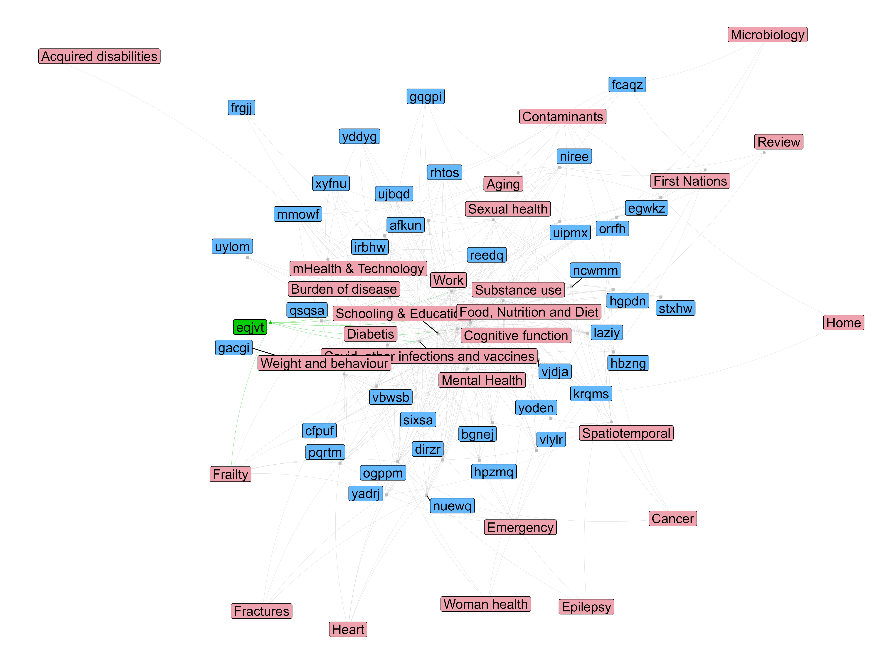

```{r setup, include=FALSE}
knitr::opts_chunk$set(echo = TRUE)
```

In spring of 2023, I gave my faculty application job presentation for what would
end up being my current appointment at the University of Waterloo. At the end of
my presentation, I had a final section showing a plot like this one:



This is a bipartite network of two types of entities: the group of faculty members at the School of Public Health Sciences and a collection of research topics (in red) derived from the abstracts published by the faculty members (in blue), and myself (in green) for the last 10 years. The nodes of the network represent each of the faculty members and the research topics, and the edges (the links between nodes) mark whether a given faculty member is associated with a research topic given their published work.

> The names of the faculty have been de-identified, but I used their real names in my presentation.

I hope the goal of having something like this is clear. First, I did this for myself, wanting to know where and how I belong among the faculty group (regarding my research). But then I thought it would be a great part of my presentation to show how do I fit, what new I bring, and my skills in a fun and original way. I remember getting good laughs and jiggles when I reached this part of the talk. I wanted to post how I did it in case it is helpful to anyone. So, let's get coding!

## Quick overview

This is what we need:

* **Coding**. A coding environment. I did this in R, so this post will show the R code, but it can be done in Python or other languages, too. Pick your weapon!
* **People**. A list of all authors we want to include in the network. In my case, that was all faculty members at the School, whose names and links to their Google Scholar pages I gathered manually. You could also extract that information from a set of papers or a bibliometric search like in [link]. It is important that you get the preferred publishing name, as we will use it to extract publication records for each author.
* **Papers**. A way to collect the abstracts for all authors for a given period of time. I used two sources: Google Scholar and PubMed. It is possible that some publications are not indexed or listed there, but the chances of missing a paper are probably small. Besides, this is not meant to be the most exhaustive search!
* **Research topics**. We can consider extracting research topics from paper titles and abstracts in several ways. You could do a painful manual process of assigning topics to papers and then aggregate them... I had around 4000 publications to process, and this is a data science blog... so I used a bit of computational help through Natural Language Processing (NLP). Clustering text is a common NLP task to find similarities between documents. I used topic modeling to find those clusters and determine topics. You could also group papers based on keywords and MeSh terms.

> **Using Large Language Models.**
When I was preparing this for my talk, I didn't have the time to learn how to set up an LLM for this (I know now!), but you can definitely use one to group papers and extract research topics, too.

* **Plotting**. We need a way to visualize the relationships between authors and research topics. I choose a bipartite network, but you can summarize the data in other ways like a [chord plot](https://www.google.com/search?q=chord+plot&sca_esv=2596775bc93bc69d&rlz=1C1GCEA_en&udm=2&biw=1536&bih=695&sxsrf=ADLYWIJr8Q0zmop0_Rnij8N1l-OuX2tNvg%3A1736621987075&ei=o7-CZ5ihBLKjptQPyJ3HyAQ&ved=0ahUKEwjY_peFre6KAxWykYkEHcjOEUkQ4dUDCBE&uact=5&oq=chord+plot&gs_lp=EgNpbWciCmNob3JkIHBsb3QyBhAAGAcYHjIGEAAYBxgeMgUQABiABDIFEAAYgAQyBRAAGIAEMgUQABiABDIEEAAYHjIEEAAYHjIEEAAYHjIEEAAYHkjCC1CcA1igB3ABeACQAQCYAUqgAY4BqgEBMrgBA8gBAPgBAZgCAqACmAGYAwCIBgGSBwEyoAfICQ&sclient=img)

## Libraries

Here the list of all the libraries I used

```{r, eval=FALSE}
library(scholar) # For parsing Google Scholar information from authors
library(tidyverse) # For data wrangling and other tasks
library(easyPubMed) # For querying PubMed

# dealing with text and topic modeling
library(textclean) # useful text cleaning functions
library(tm) # text mining functions such as data structures
library(tidytext) # more text cleaning and mining functions
library(topicmodels) # for topic modeling functions
library(textmineR) # further text mining functions

# plotting
library(igraph) # Extensive graph library
library(ggnetwork) #ggplot extension for graph plotting

# Parallel
library(parallel) # for parallel processing
```
```{r, include=FALSE}
library(tidyverse)
library(igraph)
library(ggnetwork)
library(textmineR)
library(tidytext)
library(topicmodels)
library(textclean)
library(tm)
```
```{r, include=FALSE, eval=FALSE}
raw_df<-read.csv("data.csv", na.strings = "") # load csv with data, 3 columns: names, research interest, google id
colnames(raw_df)[1]<-"name" # correct name
```

# Extract authors and abstract information

We start by extracting the list of papers from each author we want. The raw_df dataset was created manually and contains each individual's name, research interest, and Google ID. I collected this information by painstakingly going through each faculty member's profile!

```{r, eval=FALSE}

# Filter the raw_df dataset containing names, research interests, and Google IDs.
g_id_df<-raw_df%>%
  filter(!is.na(g_scholar))

# API call to get publications ids for each author
pubs<-lapply(g_id_df$g_scholar, get_publications)

# Add names of the author to each df
pubs_name<-lapply(1:length(pubs), function(i){
  pubs[[i]]$name<-g_id_df$name[i]
  pubs[[i]]$id<-g_id_df$g_scholar[i]
  pubs[[i]]
})

# collapse to a single dataset and save in disk
pubs_df<-bind_rows(pubs_name)

saveRDS(pubs_df, file = "pubs_df.Rds")
```

Now, we can extract the info per paper. The Google Scholar URL connection has a
very low time/frequency limit for making requests, which makes it difficult to
extract all the information per author. However, we can use the PubMed API to query per paper.

```{r, eval=FALSE}

# Filter for the last 10 years (from 2013 to 2023) to keep the network relevant
pubs_df_f<-pubs_df%>%
  filter(year>=2013)

# Create a set of clusters for parallel computing
cl<-makeCluster(14)
parallel::clusterEvalQ(cl, expr = {
  library(easyPubMed)
})

clusterExport(cl, varlist = "pubs_df_f")

# Iterate the paper list in parallel to extract all information (title, abstract, etc) from PubMed
pubmed_data<-pblapply(1:nrow(pubs_df_f), function(i){
  pubmed_ids<-get_pubmed_ids_by_fulltitle(pubs_df_f$title[i])
  if(pubmed_ids$Count==0){
    return(NA)
  }else{
    fetch_pubmed_data(pubmed_ids, format = "medline" )
  }
}, cl = cl)

# Save for later use. This process can take a while. Saving the results so we don't need to rerun the API calls
saveRDS(pubmed_data, "pubmed_data.Rds")

```

## Process the abstracts

Now, we can process each abstract. We do two things. First, isolate the abstract for each paper. Then, we clean the text to facilitate downstream analysis. This is a common task in natural language processing. For example, we transform all text to lowercase. Both functions for extraction (*extract_abs()*) and text cleaning (*clean_text()*) are shown at the end of the document.

```{r, include=FALSE}

#Function to extract abstracts
extract_abs<-function(x){
  if (is.null(x)) return (NA)
  start<-which(str_detect(x, "^AB  -"))
  if (length(start) == 0){
    return(NA)
  }
  count = start + 1
  while( TRUE ){
    if (str_detect(x[count], "^ ")){
      count = count +1
    }else{
      break()
    }
  }
  abstract<-paste0(x[start:(count-1)],collapse = "")
  abstract<-str_remove(abstract,"^AB  -")
  return(abstract)
}

# Function for cleaning
clean_text<- function(t){
  t <- as.character(t)
  t <- t %>%
    str_to_lower() %>%  # convert all the string to low alphabet
    replace_contraction() %>% # replace contraction to their multi-word forms
    replace_internet_slang() %>% # replace internet slang to normal words
    replace_word_elongation() %>% # replace informal writing with known semantic replacements
    replace_number(remove = T) %>% # remove number
    replace_date(replacement = "") %>% # remove date
    replace_time(replacement = "") %>% # remove time
    str_remove_all(pattern = "[[:punct:]]") %>% # remove punctuation
    str_squish() %>% # reduces repeated whitespace inside a string.
    str_trim() # removes whitespace from start and end of string
  return(as.data.frame(t))
}
```

Extract abstracts

```{r, eval=FALSE}

pubs_df_f$clean_abs<-NA
for (a in 1:length(pubmed_data)){
  cat("\r", a)
  pubs_df_f$clean_abs[a]<-extract_abs(pubmed_data[[a]])
}
```

Clean the abstracts and the titles

```{r, eval = FALSE}

pubs_df_f$clean_abs<-clean_text(pubs_df_f$clean_abs)$t
pubs_df_f$clean_title<-clean_text(pubs_df_f$title)$t

saveRDS(pubs_df_f, "pubs_df_f.Rds")
```

Now, we need to add my abstracts to the list. I could have added my Google Scholar information in the process above and processed as every other author, but I did not.

```{r, eval = FALSE}

ATE_pubs_ids<-get_pubmed_ids("abel torres espin")
ATE_pubmed_data<-fetch_pubmed_data(ATE_pubs_ids, format = "medline")

# get PMIDs
starts<-which(str_detect(ATE_pubmed_data, "^PMID"))
pmid<-ATE_pubmed_data[starts]

#extract papers
starts<-c(starts, length(ATE_pubmed_data))
ATE_pubmed_data_list<-list()

for(i in 1:(length(starts)-1)){
  ATE_pubmed_data_list[[i]]<-ATE_pubmed_data[starts[i]:(starts[i+1]-1)]
}

pubmed_data<-readRDS("pubmed_data.Rds")
pubmed_data<-append(pubmed_data,ATE_pubmed_data_list)

# Save again with the addition of my abstracts
saveRDS(pubmed_data, "pubmed_data.Rds")
```

Adding my information on the *pub_df_f* dataframe

```{r, eval = FALSE}

ATE_pubmed_data_list<-readRDS("ATE_pubmed_data_list.Rds")
ATE_pub_df<-data.frame(name = "Abel Torres Espin",
                       clean_abs = unlist(lapply(ATE_pubmed_data_list, extract_abs)),
                       pubid = pmid)
ATE_pub_df$clean_abs<-clean_text(ATE_pub_df$clean_abs)$t
pubs_df_f<-bind_rows(pubs_df_f, ATE_pub_df)

saveRDS(pubs_df_f, "pubs_df_f.Rds")
```

# Text clustering

Now that we have all the data that we need, we can start the process of clustering all abstracts given their similarities.

```{r}
# Read previous dataframe
pubs_df_f<-readRDS("pubs_df_f.Rds")

# Filter out those that are corrections or the abstract is empty
pubs_df_clustering<-pubs_df_f%>%
  filter(!str_detect(clean_abs, "this corrects the article")|is.na(clean_abs))

#If the abstract is empty, use the title. Also, remove some highly common words. 
#This is often performed because otherwise, these words might drive the whole clustering 
#solution, but they are likely present in each abstract

pubs_df_clustering<-pubs_df_clustering%>%
  mutate(clean_abs2 = ifelse(is.na(clean_abs), clean_text(title)$t, clean_abs),
         clean_abs2 = removeWords(clean_abs2, c("health","care",
                                     "use","studi", "data", "associ", "result",
                                     "research")))
pubs_df_clustering<-pubs_df_clustering%>%
  filter(!str_detect(clean_abs2, " des | de | la "))
```

Now, we can create a document term matrix, a data structure that stores the documents by tokens. In this case, we use an n-gram window of 1, which means tokens correspond to a single word.

```{r, eval=FALSE}

# create document term matrix (tokens)
set.seed(55)
dtm_clean_abs<-CreateDtm(pubs_df_clustering$clean_abs2,pubs_df_clustering$pubid,
                    ngram_window = c(1,1),
                    stopword_vec = stopwords("en"),
                    verbose = F,
                    stem_lemma_function = function(x)
                      SnowballC::wordStem(x, "en"))

## Save so that this doesn't need to run every time
saveRDS(dtm_clean_abs, "dtm_clean_abs.Rds")
```

We create a frequency matrix counting the times each token shows up across abstracts. We do some further filtering and calculate the cosine similarity between abstracts. This is a measure of how similar the documents are given the frequency of words used, with the understanding that closer abstracts would tend to use more similar words. Finally, we perform hierarchical clustering on the distance (1 - similarity).

```{r}

dtm_clean_abs<-readRDS("dtm_clean_abs.Rds")

tf_mat <- TermDocFreq(dtm_clean_abs)

## filter for tokens in more than one document
tf_mat_f<-tf_mat%>%
  filter(doc_freq>1 & doc_freq<663)%>%
  filter(!term%in%c("n", "p", "patient",
                    #"â",
                    "factor", "increas", "use", "intervent",
                    "studi", "result", ""))

# TF-IDF and cosine similarity
tfidf <- t(dtm_clean_abs[ , tf_mat_f$term ]) * tf_mat_f$idf
tfidf <- t(tfidf)

csim <- tfidf / sqrt(rowSums(tfidf * tfidf))
csim <- csim %*% t(csim)

# calculate distance
cdist <- as.dist(1 - csim)
cdist[is.na(cdist)]<-1

# Hierarchical clustering
hc <- hclust(cdist, method = "ward.D2")
plot(hc, labels = FALSE, hang = -1)

```

## Explain clusters

Now that we have clusters of documents based on their similarity, we can attempt to explain what each cluster means by checking the most frequent words in the documents for each cluster.

After extracting that list of words per cluster, I manually named each cluster, given the themes I considered appropriate from the list. You can see the five most common words per cluster

```{r, fig.height=14, fig.width=14}

tfidf_df<-as.data.frame(as.matrix(tfidf))
tfidf_df$clust<-cutree(hc, 60)

tfidf_df_sum<-tfidf_df%>%
  group_by(clust)%>%
  summarise(across(everything(), \(x) mean(x,na.rm = TRUE)))%>%
  pivot_longer(cols = -clust)

tfidf_df_sum_f<-tfidf_df_sum%>%
  group_by(clust)%>%
  slice_max(value, n = 5)%>%
  filter(value>0)

#write.csv(tfidf_df_sum_f, "tfidf_df_sum_f2.csv")

tfidf_df_sum_f %>%
  mutate(name = reorder_within(name, value, clust)) %>%
  ggplot(aes(value, name, fill = factor(clust))) +
  geom_col(show.legend = FALSE) +
  facet_wrap(~ clust, scales = "free") +
  scale_y_reordered()

```

## Graphs

Now we can plot a graph by associating each document and the author of it to a cluster/

```{r, fig.width=15,fig.height=12,preview = TRUE}

set.seed(123)

# Format the data for a network
cluster_names<-read.csv("tfidf_df_sum_f2.csv", na.strings = "")%>%
  mutate(clust_level2 = ifelse(is.na(clust_level2), clust_name, clust_level2))%>%
  group_by(clust)%>%
  summarise(clust_name = unique(clust_name),
            clust_level2 = unique(clust_level2))

pubs_df_clustering$clust <- cutree(hc, 60)

pubs_df_clustering2<-pubs_df_clustering%>%
  left_join(cluster_names%>%
              select(clust, clust_level2))%>%
  filter(!is.na(clust_level2))

pubs_df_clustering2$name<-str_trim(pubs_df_clustering2$name)

net_df<-pubs_df_clustering2%>%
  select(name, clust_level2)

# Extract a graph
g<-graph_from_data_frame(net_df, directed = F)

# Create the bipartite graph and format as a ggnetwork for plotting with ggplot
V(g)$type <- bipartite_mapping(g)$type
V(g)$size <- degree(g)
g<-simplify(g)
gg_net<-ggnetwork(g)

# Add further information on the network dataset
gg_net<-gg_net%>%
  mutate(type2 = case_when(
    name == "Abel Torres Espin"~"me",
    type == FALSE~"name",
    type == TRUE~"cluster"
  ),
  size2 = ifelse(type == FALSE, 1, 1.1),
  line_size = ifelse(type2 == "me", 0.15, 0.1))%>%
  group_by(name)%>%
  mutate(name = case_when(
    type == FALSE~paste0(sample(letters, 5, replace = T), collapse = ""),
    TRUE~name
  ))

#Finally, plot the network
ggplot(gg_net, aes(x = x, y = y, xend = xend, yend = yend)) +
  geom_edges(aes(color = type2), alpha=0.4,
             curvature = 0.1, linewidth = 0.2) +
  geom_nodes(aes(color = type2, shape = type2))+
  geom_nodelabel_repel(aes(label = name, fill = type2),
                       show.legend = F, force = 0.04,size = 6)+
  scale_color_manual(values = c("grey","green3", "grey"))+
  scale_fill_manual(values = c("lightpink2", "green3", "steelblue1"))+
  theme_blank()+
  theme(legend.position = "none")

# ggsave(filename = "bipartite_network.png", width = 16, height = 12)
```

Here another way to plot the same network.

```{r, fig.width=12}

gg_net<-ggnetwork(g, layout = igraph::layout_as_bipartite(g))
gg_net<-gg_net%>%
  mutate(type2 = case_when(
    name == "Abel Torres Espin"~"me",
    type == FALSE~"name",
    type == TRUE~"cluster"
  ),
  size2 = ifelse(type == FALSE, 1, 1.1),
  line_size = ifelse(type2 == "me", 0.15, 0.1))%>%
  group_by(name)%>%
  mutate(name = case_when(
    type == FALSE~paste0(sample(letters, 5, replace = T), collapse = ""),
    TRUE~name
  ))

ggplot(gg_net, aes(x = x, y = y, xend = xend, yend = yend)) +
  geom_edges(aes(color = type2), alpha=0.4,
             curvature = 0.1, linewidth = 0.2) +
  geom_nodes(aes(color = type2, shape = type2))+
  geom_nodelabel_repel(aes(label = name, fill = type2),
                       show.legend = F, force = 0.04,size = 4)+
  scale_color_manual(values = c("grey","green3", "grey"))+
  scale_fill_manual(values = c("lightpink2", "green3", "steelblue1"))+
  theme_blank()+
  theme(legend.position = "none")
```

And that it is! I hope this is useful so someone. I cannot say I got the job because it, but I can tell I got some good smiles in the room! I achieved what I wanted: an original way to show my skills, how I am as a researcher, and how I fit among all these incredible people.

---
```{r, eval==FALSE}

#Function to extract abstracts
extract_abs<-function(x){
  if (is.null(x)) return (NA)
  start<-which(str_detect(x, "^AB  -"))
  if (length(start) == 0){
    return(NA)
  }
  count = start + 1
  while( TRUE ){
    if (str_detect(x[count], "^ ")){
      count = count +1
    }else{
      break()
    }
  }
  abstract<-paste0(x[start:(count-1)],collapse = "")
  abstract<-str_remove(abstract,"^AB  -")
  return(abstract)
}
# Function for cleaning
clean_text<- function(t){
  t <- as.character(t)
  t <- t %>%
    str_to_lower() %>%  # convert all the string to low alphabet
    replace_contraction() %>% # replace contraction to their multi-word forms
    replace_internet_slang() %>% # replace internet slang to normal words
    replace_word_elongation() %>% # replace informal writing with known semantic replacements
    replace_number(remove = T) %>% # remove number
    replace_date(replacement = "") %>% # remove date
    replace_time(replacement = "") %>% # remove time
    str_remove_all(pattern = "[[:punct:]]") %>% # remove punctuation
    str_squish() %>% # reduces repeated whitespace inside a string.
    str_trim() # removes whitespace from start and end of string
  return(as.data.frame(t))
}
```
