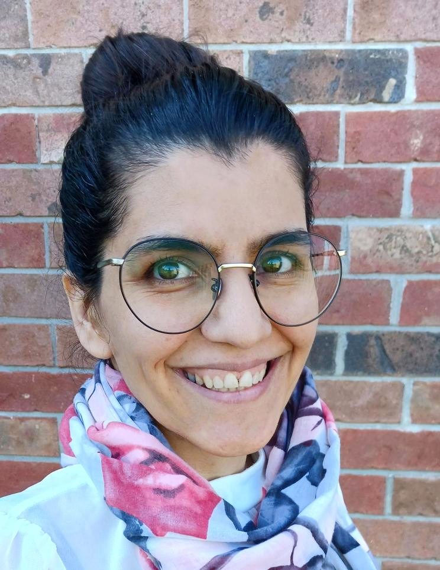
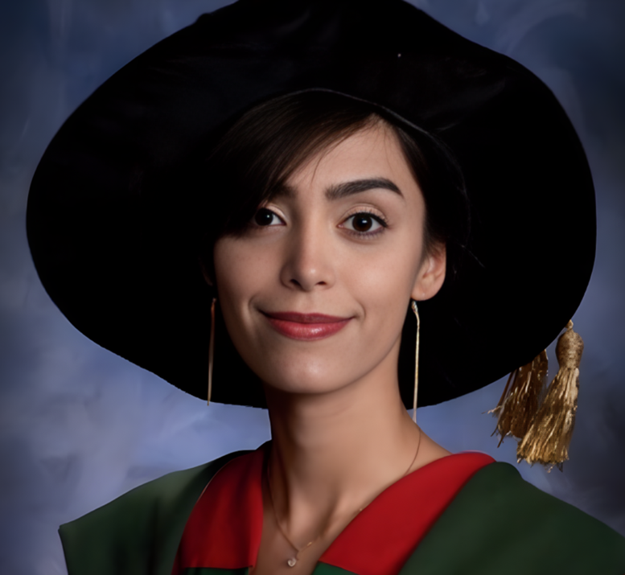
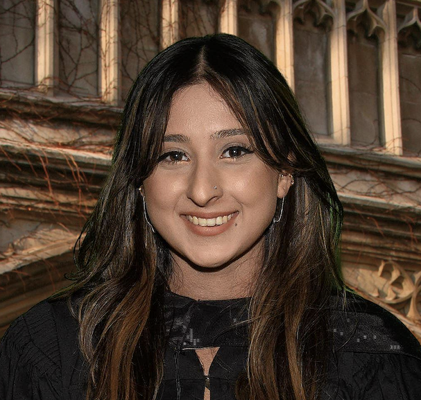
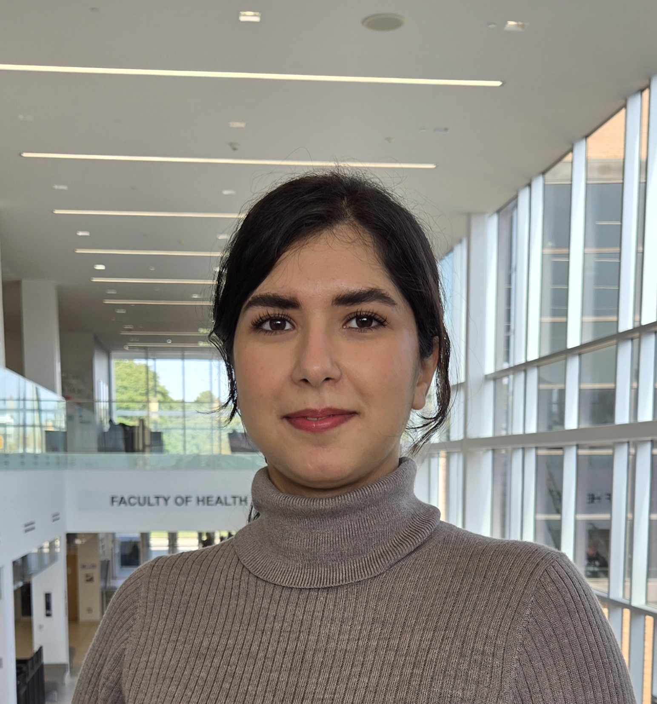
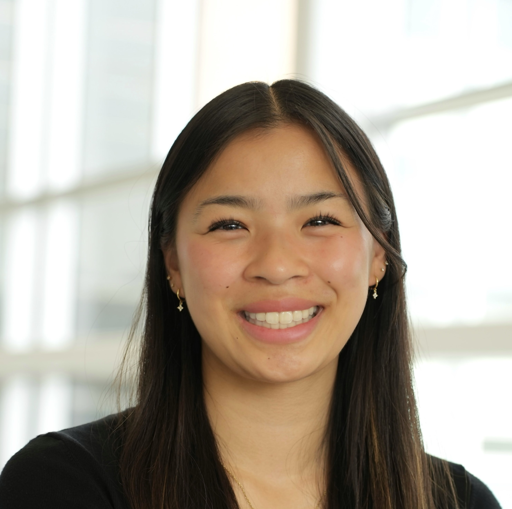
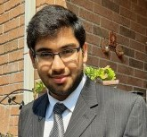
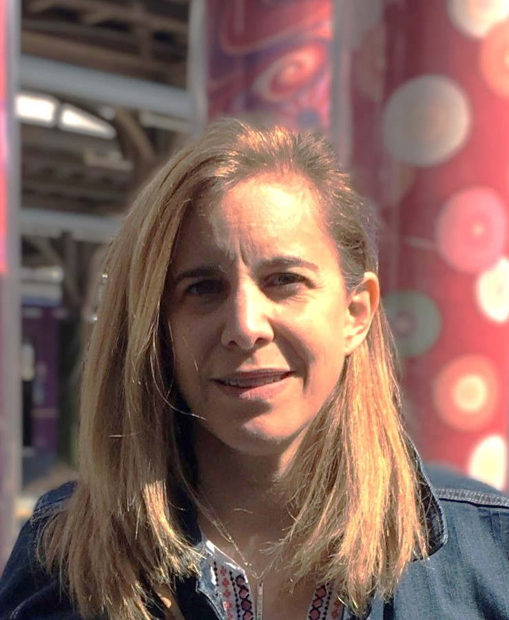

```{r setup, include=FALSE}
knitr::opts_chunk$set(echo = FALSE)
```

<!-- # Work with us -->

<!-- We have some positions available for graduate students and Postdoctoral researchers. Please email Abel if you are interested on working with us. -->

# health.data DRIVEN Lab members

### Abel Torres Espín

<div style="display: inline-block;margin:0 10px 10px 0" markdown="1">
  <p></p><br>
  <p><strong>Principal Investigator</strong><br>
     Assistant Professor, University of Waterloo, Waterloo
     Adjunct Professor, University of Alberta, Edmonton
     Assistant Adjunct Professor, University of California San Francisco</p>
</div>


**Bio**

I was born in Mataró, a city close to Barcelona in Spain. I studied biology at the Universitat de Barcelona from 2002 to 2007. With interest in neuroscience, I began my PhD in 2008 at the Universitat Autonoma de Barcelona under the supervision of Dr. Xavier Navarro. I moved to Canada in 2014 for a postdoctoral position at the University of Alberta in Edmonton under the supervision of Dr. Karim Fouad. Here, I worked on the interaction between neuroinflammation and rehabilitation after spinal cord injury. From November 2018 to 2020, I worked at the University of California San Francisco (UCSF) in a team led by Dr. Adam Ferguson, on the application of data science to accelerate neurological research and translation. In 2020, I was hired at UCSF as an Assistant Adjunct Professor in the Department of Neurological Surgery. Since August 2023 I hold an Assistant Professor position at the University of Waterloo in Canada.

**Research interest**

My broad work is in the application of data science methods to health research. I am interested in conceptualizing health and disease as complex multi-domain (e.g., biological, medical, psychological, social, technological), multi-level (e.g., molecular, individual, and population), and dynamic process. I focus on applying health data science, and machine learning solutions, integrating diverse data resources to answer health-related questions and inform practice. With increasing health and healthcare challenges, the growing availability of digital health data provides unprecedented opportunities to study this complexity and inform precise evidence-based practice and policies. My research has focused on the health context of complex heterogeneous population such as spinal cord injury, traumatic brain injury, dementia, and chronic low back pain, resulting in tremendous individual and societal costs. I am also interested in analytical and computational methods, multivariate statistics, the reproducibility and replicability of research, and real-world evidence.

### Marzieh Mussavi Rizi

<div style="display: inline-block;margin:0 10px 10px 0" markdown="1">
  <p></p><br>
  <p><strong>Postdoctoral Fellow</strong><br>
      University of Waterloo, Waterloo</p>
</div>

I am a postdoctoral fellow at the University of Waterloo, working under the guidance of Professor Abel Torres Espin. My research is centered around personalized medicine and causal inference, specifically implementing machine learning methods for precision medicine concerning spinal cord injury. Prior to this, I earned my Ph.D. in biostatistics from the University of Waterloo, where my focus was on dynamic treatment regimes. In general, my interest lies in the application of statistical methods to address novel challenges within the realm of interdisciplinary problem-solving.

### Mahsa Panahi

<div style="display: inline-block;margin:0 10px 10px 0" markdown="1">
  <p></p><br>
  <p><strong>Postdoctoral Fellow</strong><br>
      University of Waterloo, Waterloo</p>
</div>

I am honored to be a Postdoctoral Fellow in the Public Health Sciences Department at the University of Waterloo, working under the guidance of Prof. Abel Torres Espin. My research focuses on leveraging causal inference and machine learning methodologies to diagnose specific spinal cord diseases through the analysis of patient movement patterns.
Prior to this role, I earned my Ph.D. in Statistics from the University of Waterloo, where I focused on innovative design of experiment and statistical techniques for root-cause analysis. My passion lies in modeling and interpreting complex datasets, aiming to address and solve real-world challenges through data-driven insights.

### Simran Saggu

<div style="display: inline-block;margin:0 10px 10px 0" markdown="1">
  <p></p><br>
  <p><strong>PhD Student</strong><br>
      University of Waterloo, Waterloo</p>
</div>

I am thrilled to be embarking on my journey as a PhD student in Public Health Sciences department at the University of Waterloo, under the mentorship of Dr. Abel Torres Espin.

Prior to this exciting opportunity, I successfully earned my Master of Public Health degree from McMaster University, where I honed my skills and deepened my understanding of biostatistics, epidemiology, and evidence-informed decision making. My academic journey has prepared me to tackle complex interdisciplinary challenges within the field of public health.

During my PhD, my research will delve into the realm of data reproducibility and replicability, with a particular focus on harnessing machine learning techniques in the context of spinal cord injury, primarily using animal models. Ultimately, the research aims to contribute to the development and implementation of precision medicine strategies in the broader fields of research, medicine, and public health.

### Vladyslav Shein

<div style="float:left;margin:0 10px 10px 0" markdown="1">
  <p></p><br>
  <p><strong>Msc Student</strong><br>
      University of Waterloo, Waterloo</p>
</div>

Vladyslav is a master's student in Public Health Sciences at the University of Waterloo, working under the mentorship of Professor Abel Torres Espin. His academic path includes a Bachelor of Education and a Master of Science in Computer Science from Drahomanov Ukrainian State University. There, he developed an interest in the study of student evaluation processes, combining his skills in data analysis with educational concepts. With a foundation in data science and social sciences, Vladyslav is now focused on applying his knowledge to tackle health challenges, contributing to the field of Public Health.

### Parisa Razavi Yeganeh

<div style="display: inline-block;margin:0 10px 10px 0" markdown="1">
  <p></p><br>
  <p><strong>Msc student</strong><br>
      University of Waterloo, Waterloo</p>
</div>

I am currently pursuing a Master of Science in Public Health under the supervision of Dr. Abel Torres and Dr. Joel Dubin. I also hold a master’s degree in Healthcare Systems Engineering, where I focused on emotion recognition from EEG signals using neural networks. My interests lie in precision medicine, artificial intelligence, and machine learning in healthcare, with a passion for helping healthcare providers make informed decisions through data-driven insights. Currently, I am focusing on utilizing machine learning techniques in the context of spinal cord injury research

### Tienna Schade

<div style="display: inline-block;margin:0 10px 10px 0" markdown="1">
  <p></p><br>
  <p><strong>Undergraduate student</strong><br>
      University of Waterloo, Waterloo</p>
</div>

I am an undergraduate Health Sciences student with a wide variety of interests, but particularly in interdisciplinary health research. Currently, I am conducting a systematic scoping review of causal models and networks that explore the complexities of spinal cord injury through the lens of the biopsychosocial model, under the guidance of Drs. Abel Torres Espin and Marzieh Mussavi Rizi.

### Rahul Desai

<div style="display: inline-block;margin:0 10px 10px 0" markdown="1">
  <p></p><br>
  <p><strong>Undergraduate student</strong><br>
      University of Waterloo, Waterloo</p>
</div>

Rahul is an undergraduate, Health Science student at the University of Waterloo. Rahul is an aspiring physician who has a passion for improving the lives of others. He advocates for better access to care and for reducing inequalities that exist in the healthcare system. Furthermore, Rahul is involved in learning the different aspects of care through his co-ops and volunteering experience at University Health Network, Sunnybrook Health Science Centre and Scarborough Health Network. His research focuses on using data to understand cancer drug policy and reimbursement in Canada, based on patient health outcomes. Furthermore, he is particularly interested in electronic medical records and AI in the development of new treatment regimens to improve patients' health and well-being. Besides his passion for learning and helping others, Rahul loves connecting with nature by visiting trails, parks and open spaces throughout the city, province and country.

### Ornell Corvaglia-Douglas

<div style="display: inline-block;margin:0 10px 10px 0" markdown="1">
  <p></p><br>
  <p><strong>Project Manager</strong><br>
      University of Waterloo, Waterloo</p>
</div>

Ornell Douglas, MPH, is a Project Manager with more than 20 years’ experience in the areas of chronic disease prevention through program development, research, evaluation, and knowledge translation. She received her Bachelor of Kinesiology from McMaster University, and her Master of Public Health from the University of Waterloo. She has worked in NGO and Academic environments, with the last 13 years spent applying evidence-informed and systematic approaches to problem solving across multiple areas of applied health science research within the School of Public Health Sciences at the University of Waterloo.

<!-- # Active and Past Collaborations -->

<!-- * `Fouad Lab`: Karim Fouad team at University of Alberta -->
<!-- * `Fenrich Lab`: Keith Fenrich at University of Alberta -->
<!-- * `Human Movement Lab`: Juan Forero at University of Alberta -->
<!-- * `Ferguson Lab`: Adam Ferguson team at University of California San Francisco -->
<!-- * `Kyritsis Lab`: Nikos Kyritsis team at University of California San Francisco -->
<!-- * `METRiCS group`: Jeannie Bailey, Ryan Halvorson and Robert Matthew at University of California San Francisco -->
<!-- * `Elahi Lab`: Fanny Elahi team at University of California San Francisco -->
<!-- * `REACH study`: Core Center for Patient-centric, Mechanistic Phenotyping in Chronic Low Back Pain at University of California San Francisco -->
<!-- * `TRACK-TBI study`: Transforming Research And Clinical Knowledge in TBI at University of California San Francisco -->
<!-- * `TRACK-SCI study`: Transforming Research And Clinical Knowledge in SCI at University of California San Francisco -->
<!-- * `Udina group`: Esther Udina team at Universitat Autónoma de Bercelona -->
