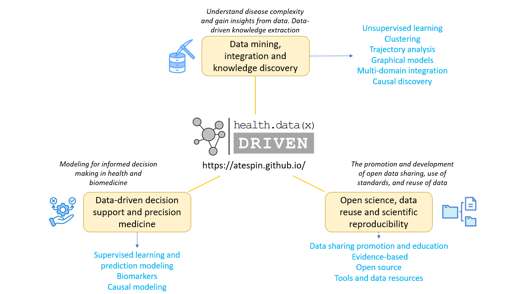

```{r setup, include=FALSE}
knitr::opts_chunk$set(echo = TRUE)
```

We specialize in health and biomedical data science, using data science methods to address biomedical and health inquiries and conduct research.

<div>
  <p>
</div>

## Data mining, data integration, and knowledge discovery

As we gather more and more data and encounter increasingly complex health issues, it becomes important to use data discovery methods to uncover hidden patterns in large datasets. This can provide valuable insights for research and practical applications. We use data science methods and tools, like unsupervised and representation learning, to discover patterns in the data. By exploring unobserved differences and identifying patterns, we can better understand the data, develop hypotheses, and generate new knowledge. We also use complex system and system mapping approaches to understand how different factors are connected. Some of the methods we use include principal component analysis, matrix factorization, clustering, deep learning, graphical models, and trajectory analysis, among others.

> Example: Our project that focuses on integrating data from multiple domains and grouping chronic low back pain patients based on similarities.

## Data-driven decision support and precision medicine

Having more and better information helps us make better decisions. We work on data-driven approaches to support experts and knowledge users in making complex decisions. This includes using supervised learning on large and diverse datasets to create and validate models that help clinicians, administrators, and others make informed decisions.

> Example: Our project that focuses on predicting important early health outcomes in spinal cord injury by modeling routine laboratory values.

## Open science, data reuse, and scientific reproducibility

A portion of our research activities focus on the intersection of biomedical research and data science, particularly on data use and reuse. We apply, explore, and develop data science methods to increase reproducibility, replicability, accelerate translation, and improve our understanding of data reuse.

> Example: Our project that involves reusing published data on historical controls to build mathematical models of recovery after spinal cord injury. These models are used as generators of synthetic data to increase reliability in treatment inference.

### Open and FAIR data sharing

We take part in various open and FAIR (Findable, Accessible, Interoperable, and Reusable) data sharing projects and initiatives.

### Open Data Commons

The Open Data Commons (ODC) are online databases for spinal cord injury (ODC-SCI) and traumatic brain injury (ODC-TBI) research. The goal of the ODCs is to improve SCI and TBI research by encouraging open and collaborative sharing of data that is Findable, Accessible, Interoperable, and Reusable (FAIR).

**For Spinal Cord Injury**: [odc-sci.org](https://odc-sci.org/)

**For Traumatic Brain Injury**: [odc-tbi.org](https://odc-tbi.org/)

### Better tools for better research

While it's not our main focus, sometimes we create or work together on making software and hardware that can automate research and make experiments more efficient. Don't forget to check out the tools section!

## Big-data Clinical studies

We collaborate with clinical studies that focus on collecting big and detailed data.

### Neurotrauma

[TRACK-TBI: Transforming Research and Clinical Knowledge for Traumatic Brain Injury](https://tracktbi.ucsf.edu/) at UCSF

[TRACK-SCI: Transforming Research and Clinical Knowledge for Spinal Cord Injury](https://spinalcordinjury.ucsf.edu/) at UCSF

### Chronic Low Back Pain

[REACH: Core Center for Patient-centric, Mechanistic Phenotyping in Chronic Low Back Pain](https://comeback.ucsf.edu/research) at UCSF


